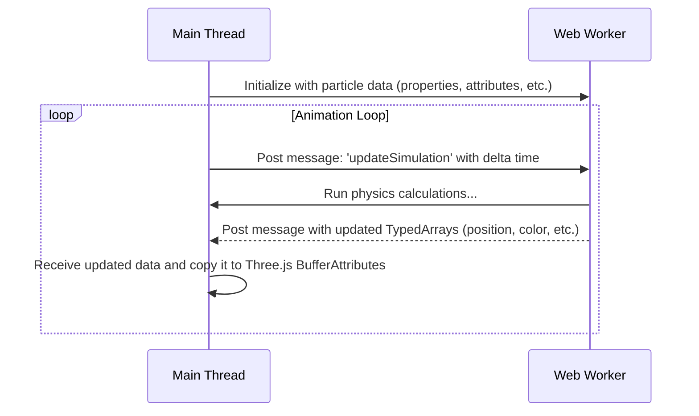

# JS Particle System

A pure JavaScript particle system library designed for use with Three.js. It supports both single-threaded and multi-threaded (Web Worker) operation for high-performance particle simulations.

## Architecture

This library can be run in two modes: single-threaded and multi-threaded.

### Single-Threaded

In this mode, the particle simulation and rendering both run on the main browser thread. This is the simplest setup and is suitable for less demanding simulations. All calculations happen synchronously within the `requestAnimationFrame` loop.

- **Pros:** Easy to set up and debug. Direct access to all Three.js objects.
- **Cons:** Can block the main thread and cause UI jank or stuttering with a large number of particles.

### Multi-Threaded (Web Worker)


For heavy simulations, the system can offload all particle physics calculations to a Web Worker. The main thread is responsible only for initializing the system and updating the Three.js buffer attributes with the data calculated by the worker.

- **Pros:** Keeps the main thread free, resulting in a smooth UI and higher performance for complex scenes.
- **Cons:** More complex setup. Data transfer between the main thread and the worker has overhead. Direct access to Three.js objects from the worker is not possible.

#### Workflow Diagram



## API

The core of the library is the `Particles` class.

### `Particles` Class (Main Thread)

This class, defined in `workerParticles.js`, is used to create and manage a particle system.

**Initialization:**
- `InitializeParticles(scene, mesh, config)`: Creates an `InstancedBufferGeometry` and initializes the particle system using a configuration object. The `config` object can include properties like `amount`, `maxLifeTime`, `burstCount`, `useWorker`, etc.

**Configuration:**
- All configuration is now done through setter methods on the `Particles` instance (e.g., `setForce`, `setMaxLifeTime`). These methods can be called at any time, and if the system is running in multi-threaded mode, the changes will be automatically proxied to the worker.

**Updating the Simulation:**
- `updateSimulation(delta)`: Runs the physics simulation for one frame. The API is the same for both single-threaded and multi-threaded modes.

### Multi-Threaded API

The multi-threaded API is now seamless. To enable the web worker, you simply pass `useWorker: true` in the configuration object during initialization.

- `config.useWorker` (boolean): When `true`, the `Particles` class automatically creates a `WorkerManager` to handle the simulation in a separate thread.
- `WorkerManager`: This class is used internally by the `Particles` class to manage the worker's lifecycle and communication. You do not need to interact with it directly.

## Usage Examples

Here are basic examples of how to set up and run the particle system in both modes.

### Single-Threaded Example

This setup is simpler and runs entirely on the main thread. It's ideal for smaller, less intensive particle effects.

```javascript
import * as THREE from 'three';
import { Particles } from './lib'; // Adjust path as needed

// 1. Basic Three.js Scene Setup (Same as above)
// ...

// 2. Create a Particle System Instance
const particleSystem = new Particles();
const geometry = new THREE.BoxGeometry(1, 1, 1);
const material = new THREE.MeshBasicMaterial({ color: 0x00ff00 });
const mesh = new THREE.Mesh(geometry, material);

// 3. Initialize the Particles using the config object
particleSystem.InitializeParticles(scene, mesh, {
    amount: 10000
    // useWorker defaults to false
});

// 4. Configure Particle Properties
particleSystem.setForce([0, -9.8, 0]); // Apply gravity
particleSystem.setMaxLifeTime(5, true, 2, 8); // Random lifetime between 2 and 8 seconds
// ... add other configurations ...
particleSystem.startPS(); // Start the particle system simulation

// 5. Animation Loop
const clock = new THREE.Clock();
function animate() {
    requestAnimationFrame(animate);
    const delta = clock.getDelta();

    // Update the simulation on the main thread
    particleSystem.updateSimulation(delta);

    renderer.render(scene, camera);
}

animate();
```

### Multi-Threaded Example

This setup offloads physics calculations to a Web Worker. The API is now almost identical to the single-threaded version.

```javascript
import * as THREE from 'three';
import { Particles } from './lib';

// 1. Basic Three.js Scene Setup (Same as above)
// ...

// 2. Create a Particle System Instance
const particleSystem = new Particles();
const geometry = new THREE.BoxGeometry(1, 1, 1);
const material = new THREE.MeshBasicMaterial({ color: 0x00ff00 });
const mesh = new THREE.Mesh(geometry, material);

// 3. Initialize the Particles with the worker enabled
particleSystem.InitializeParticles(scene, mesh, {
    amount: 50000,
    useWorker: true
});

// 4. Configure Particle Properties (Same as single-threaded)
// Any changes made here are automatically synced with the worker.
particleSystem.setForce([0, -9.8, 0]);
particleSystem.setMaxLifeTime(5, true, 2, 8);
// ...
particleSystem.startPS();

// 5. Animation Loop
const clock = new THREE.Clock();
function animate() {
    requestAnimationFrame(animate);
    const delta = clock.getDelta();

    // The API call is the same! The Particles class handles delegating to the worker.
    particleSystem.updateSimulation(delta);

    renderer.render(scene, camera);
}

animate();
```

## Data Structures

The particle system relies on `TypedArray`s for efficient data storage and transfer. Key arrays include:

- **`transform` (`Float32Array`):** Stores the (x, y, z) position of each particle. Stride of 3.
- **`scale` (`Float32Array`):** Stores the (x, y, z) scale of each particle. Stride of 3.
- **`rotation` (`Float32Array`):** Stores the (x, y, z) euler rotation of each particle. Stride of 3.
- **`color` (`Uint8Array`):** Stores the (r, g, b) color of each particle. Stride of 3.
- **`lifeTime` (`Float32Array`):** This array is critical for managing particle lifecycles. It has a **stride of 2**. For each particle, it stores:
    - `[0]`: The particle's current age.
    - `[1]`: The particle's maximum lifetime.
    The array is therefore twice the length of the total number of particles.

## Limitations of the Multi-Threaded Version

Due to the nature of Web Workers, certain features that require direct access to main-thread objects (like the Three.js `scene` or `material` objects) are not available in the worker simulation.

- **Complex Callbacks:** Functions like `onParticleBirth` and `onParticleKill` cannot be used with callbacks that reference objects or scope outside of the worker.
- **Child Particle Systems:** The `addChildParticleSysthem` feature is not supported in the multi-threaded version, as it's not possible to pass complex `Particles` objects between threads.
- **Direct Object Manipulation:** Any logic that attempts to directly manipulate the `THREE.InstancedMesh` or its material from within the simulation loop will not work. All visual updates must be achieved by modifying the data in the `TypedArray`s, which are then copied to the GPU buffers on the main thread.
